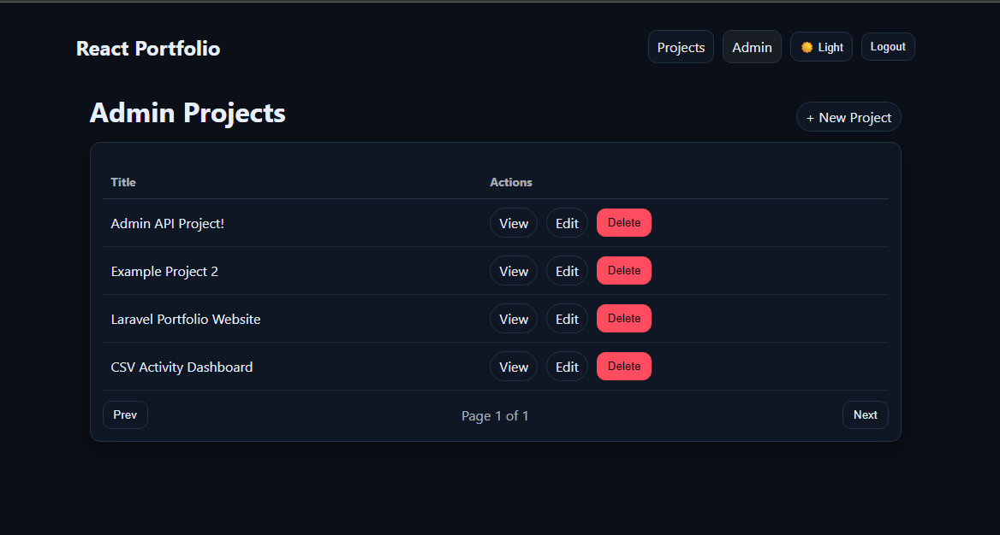
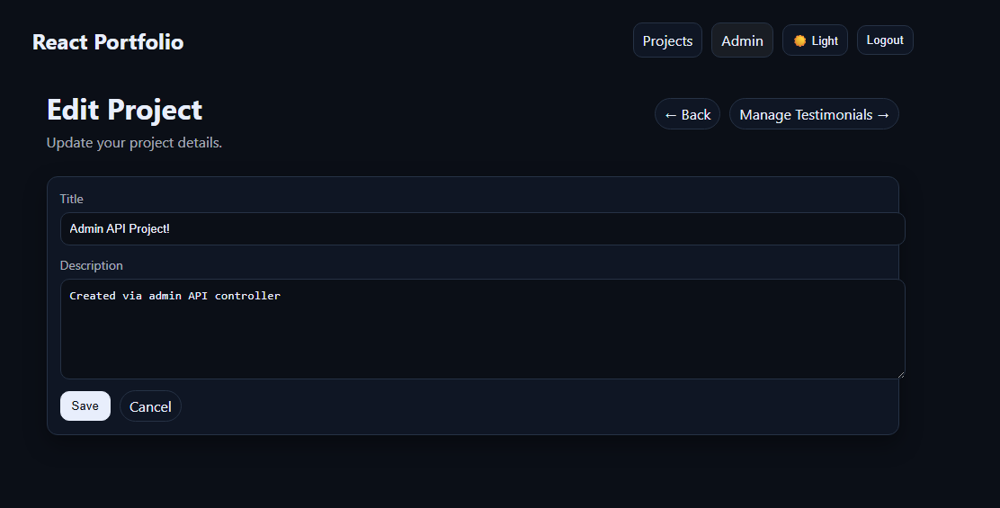
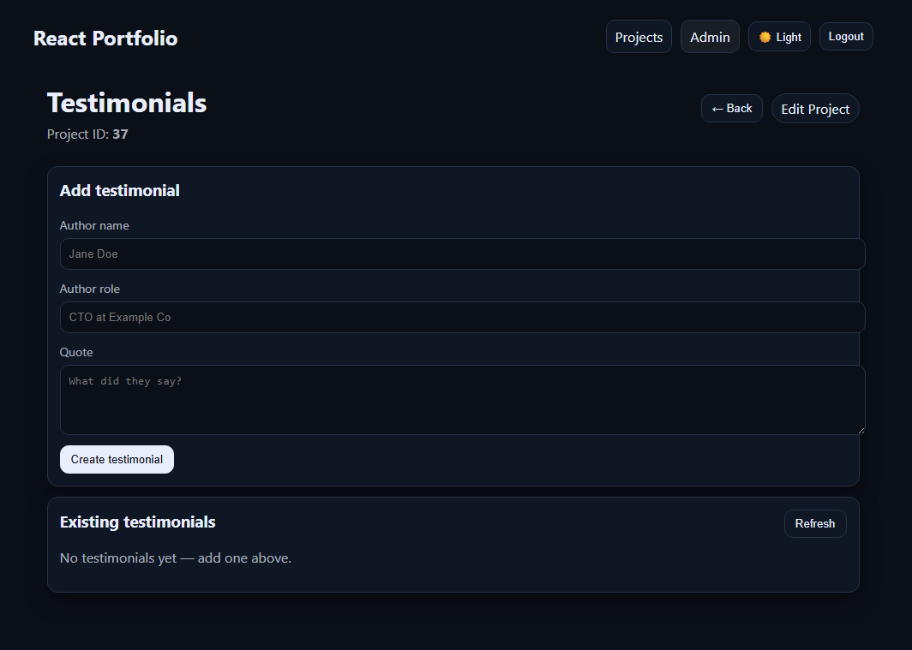

# Laravel Portfolio Website (Headless / API-First)

A **headless, API-first Laravel application** featuring a Blade reference frontend, a **Sanctum-secured admin API**, and a **React SPA admin dashboard** consuming the same backend APIs.

The project is structured with clean validation, middleware-based authorization, and a decoupled architecture that allows new frontends (SPA or mobile) to be added **without rewriting backend logic**.

---

## Overview

This project began as a personal portfolio website and evolved into a **production-style API-first Laravel backend** with multiple consumers.

The application exposes:
- A **public, read-only JSON API**
- A **Sanctum-protected admin API** for full CRUD operations
- A **Blade-based reference frontend**
- A **React SPA admin dashboard** with token-based authentication

Blade and React are treated as **clients**, not the core of the system.  
All business logic, validation, and authorization live exclusively in the backend.

---

## Architecture Overview

This project follows a **headless / API-first architecture**.

- Backend logic centralized in Laravel
- Public and admin APIs clearly separated
- Multiple frontends consume the same models and database
- No business logic duplicated between clients

### Current Consumers
- **Blade UI** – server-rendered reference frontend  
- **React SPA** – public project browsing  
- **React Admin Dashboard** – authenticated CMS  
- **Postman** – API testing  

---

## Features

### Blade Reference Frontend (Public)
- Home, About, Projects, and Contact pages
- Projects displayed with associated testimonials
- Contact form with server-side validation and rate limiting
- Friendly feedback instead of hard 429 errors
- Old input preserved on validation errors

> Blade exists primarily as a reference frontend and mirrors API and database changes automatically.

---

### React Admin Dashboard (SPA)

- Token-based login using **Laravel Sanctum**
- Protected routes using client-side guards
- Full CRUD for:
  - Projects
  - Testimonials
- Public read / admin write separation
- Auto-logout on expired tokens (401 handling)
- Toast notifications for success and error feedback
- Dark mode toggle with persistent theme selection

---

## Screenshots — Blade Reference UI

### Public Portfolio


### Admin – Projects CMS


### Admin – Testimonials CMS


## Screenshots — React SPA

### React – Admin Projects Index


### React - Project Editing


### React – Edit Testimonials CMS


---

## Authentication & Admin Access

- Authentication implemented using **Laravel Breeze**
- Token-based authentication using **Laravel Sanctum**
- Admin access enforced via custom middleware (`EnsureAdmin`)
- Admin access rules:
  - Allowlisted email address, or
  - `users.is_admin = 1` flag

---

## Public API (Read-Only, No Auth)

The application exposes a **public JSON API** intended for frontend clients such as SPAs or mobile apps.

### Available Endpoints
- `GET /api/projects` — paginated list of projects
- `GET /api/projects/{project}` — single project
- `GET /api/projects/{project}?include=testimonials`
- `GET /api/projects/{project}/testimonials`

### API Characteristics
- Read-only (no authentication required)
- Pagination handled server-side
- `per_page` clamped between 1–50
- Responses formatted using **Laravel API Resources**
- Clean timestamp formatting

---

## Admin API (Sanctum-Protected)

All write operations are exposed **exclusively via authenticated API endpoints**.

### Authentication
- Token-based authentication using **Laravel Sanctum**
- Tokens issued and revoked via API endpoints
- Tokens tested using Postman and React SPA

### Admin CRUD APIs
- Projects: create, update, delete
- Testimonials: create, update, delete
- Authorization enforced at middleware + controller level
- No write access exposed publicly

---

## Security & Validation

- Custom `EnsureAdmin` middleware
- Strict server-side validation using **Form Requests**
- Input whitelisting on all write operations
- Rate limiting applied to public endpoints
- Controllers kept thin and focused

---

## Project Structure (Simplified)

```bash
app/
├── Http/
│   ├── Controllers/
│   │   ├── Admin/
│   │   └── Api/
│   ├── Middleware/
│   ├── Requests/
│   └── Resources/
├── Models/
routes/
├── web.php
├── api.php
resources/
├── views/
├── js/
│   └── react/
```

---

## Local Setup

```bash
git clone https://github.com/Danyy737/laravel-portfolio-website.git
composer install
cp .env.example .env
php artisan key:generate
php artisan migrate
php artisan serve
```
Visit http://127.0.0.1:8000 to view the application.


## Purpose of This Project

This project demonstrates:
- Headless / API-first Laravel architecture
- Secure token-based authentication using Sanctum
- Clean validation and authorization patterns
- Practical API design for real frontend consumers
- SPA admin dashboard consuming backend APIs
- Scalable backend structure suitable for future clients

It is intentionally built beyond a basic CRUD application to reflect real backend and full-stack development practices.

## Author

Daniel Mourad  
Full-stack developer with a backend-first focus.


