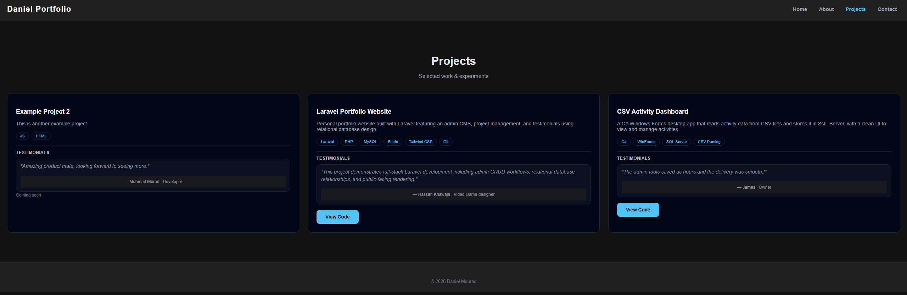
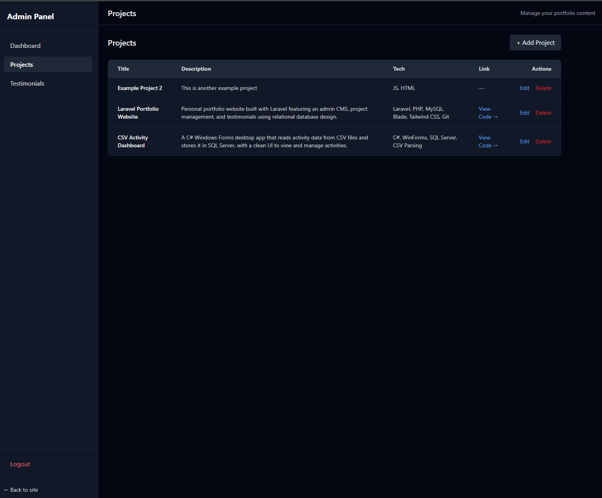
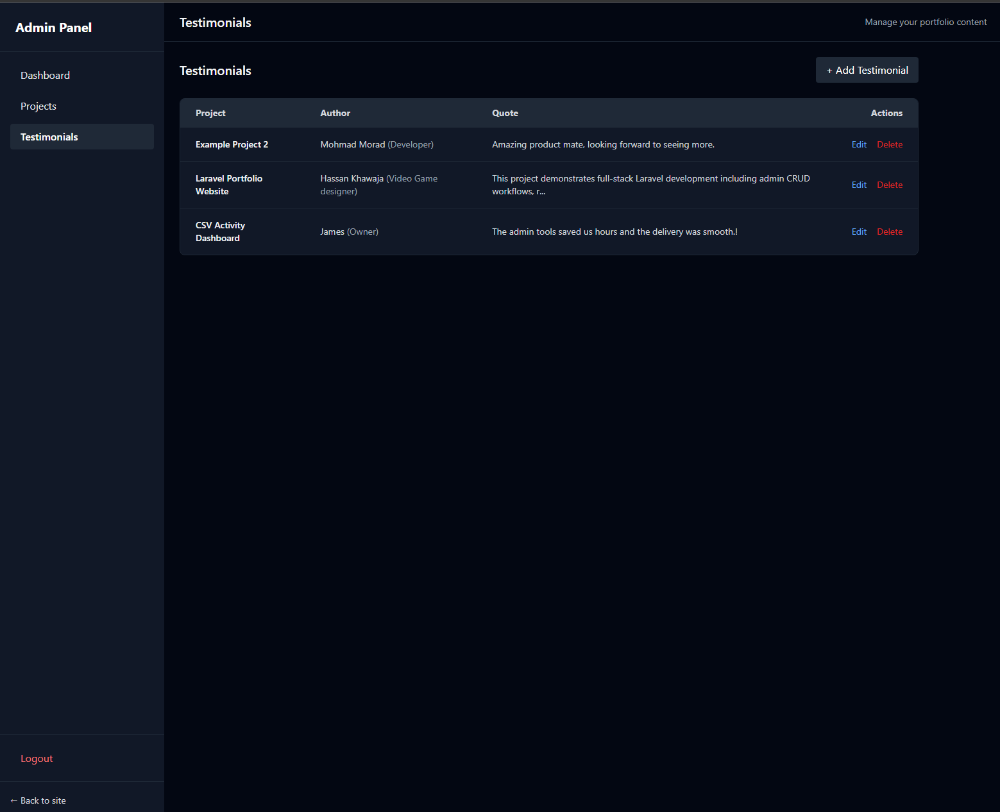

# Laravel Portfolio Website

A personal portfolio website built with Laravel featuring a custom admin CMS.

## Features
- Admin authentication
- Project CRUD management
- Testimonials linked to projects (one-to-many)
- Public-facing portfolio pages
- Relational database design using Eloquent

## Screenshots

### Public Portfolio


### Admin – Projects CMS


### Admin – Testimonials CMS


## Tech Stack
- Laravel
- PHP
- MySQL
- Blade
- Tailwind CSS
- Git & GitHub

## Setup (Local)
```bash
composer install
cp .env.example .env
php artisan key:generate
php artisan migrate
php artisan serve

## Security & Validation

This project uses multiple layers of protection for admin and public endpoints:

- **Admin access control:** Admin routes are protected by a custom `admin` middleware. Only a specific allowlisted email or users with `is_admin = 1` can access `/admin`.
- **Rate limiting (Contact form):** `POST /contact` is rate-limited (1 submission/minute) and uses a friendly throttle message instead of a hard 429 page.
- **Form Request validation:** All create/update actions use Laravel Form Requests (`Store*/Update*Request`) to enforce strict server-side validation and input whitelisting.
  - Controllers only accept `$request->validated()` data.
  - Unexpected fields are rejected/dropped before reaching business logic.
  - Validation failures redirect back with errors and preserve old input for a good UX.

This keeps controllers clean, improves data integrity, and makes future API endpoints safer by reusing the same validation rules.
